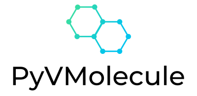
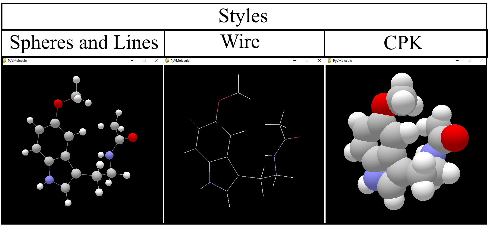

Molecular Viewer for chemical structures developed with OpenGL and Pygame
python version: 3.8.9

## Requirements
~~~
numpy==1.20.2
openbabel==3.1.1
pygame==2.0.1
PyOpenGL==3.1.5
~~~

## Installation 
~~~bash
pip install -r requirements.txt
~~~

## Usage 
~~~bash
python pyvmolecule.py <file> <style>
~~~

**file**: file name (including file extension ->
"melatonin.sdf")

**style**: molecular model (styles -> [wire, cpk])

***Note***: Style default Spheres and Lines

Example:
~~~bash
python pyvmolecule.py melatonin.sdf
python pyvmolecule.py melatonin.sdf wire
python pyvmolecule.py melatonin.sdf cpk
~~~

## Contact 

jgonzalez76@uc.edu.ve
